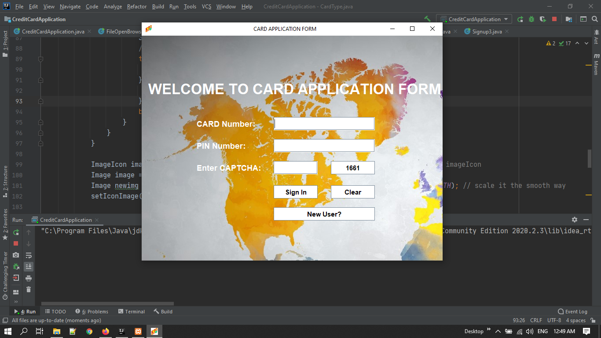

# CreditCardApplication
This is VTU DBMS 5th Semester Mini Project. Credit Card Approval System is developed to record the details of various activities of the user. This Credit Card Approval System is used to overcome the entire problem which they are facing currently, and making complete atomization of manual system to computerized system.

## Credit Card Automation App: 
 
 
  <kbd>
  	<a href="https://github.com/deepakjaiswal2018" target="_blank">
		</img>
	</a>
  </kbd>

